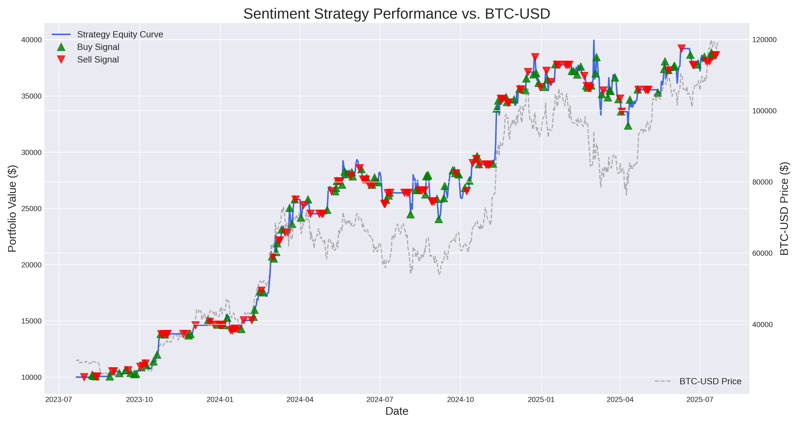

# Sentiment-Driven Algorithmic Trading System

*(Example of a backtesting performance plot generated by the system)*

This repository presents a **Sentiment-Driven Algorithmic Trading System** designed to generate actionable trading signals by leveraging real-time sentiment analysis from diverse data sources and integrating them with traditional market indicators. The system employs advanced Natural Language Processing (NLP) models, robust data ingestion pipelines, and a comprehensive backtesting framework to evaluate and refine trading strategies.

## 🌟 **Features**

Our system is built with a modular and extensible architecture, focusing on accuracy, real-time processing, and comprehensive analysis.

### **1. Multi-Source Data Ingestion**

The system continuously gathers and processes data from various real-time sources to capture a holistic market view.

- **Twitter (X)**: Analyzes tweets for sentiment related to specific financial symbols. Utilizes the Twitter API for recent tweet searches.
- **Reddit**: Processes posts and comments from popular financial and cryptocurrency subreddits (e.g., ```
  r/CryptoCurrency
  ```

  , ```
  r/wallstreetbets
  ```

  , ```
  r/investing
  ```

  ) to gauge community sentiment.
- **News APIs**: Extracts sentiment from financial news articles, providing insights from professional media outlets.
- **Market Data**: Fetches real-time price, volume, and market capitalization data for both cryptocurrencies and stocks using Yahoo Finance.

### **2. Ensemble Sentiment Analysis**

To ensure robust and reliable sentiment scores, the system combines multiple state-of-the-art NLP models.

- **FinBERT**: A Bidirectional Encoder Representations from Transformers (BERT) model specifically fine-tuned for financial sentiment analysis. It provides nuanced positive, negative, and neutral classifications.
- **VADER (Valence Aware Dictionary and sEntiment Reasoner)**: A lexicon and rule-based sentiment analysis tool that is particularly well-suited for social media texts.
- **TextBlob**: A simplified API for common NLP tasks, including sentiment analysis, offering a quick and easy way to get polarity and subjectivity scores.
- **Weighted Aggregation**: Sentiment scores from individual models are combined using configurable weights (e.g., FinBERT: 60%, VADER: 30%, TextBlob: 10%) to produce a consolidated sentiment score.
- **Confidence Scoring**: A confidence score is generated for each aggregated sentiment, reflecting the agreement level among the different NLP models. Higher agreement leads to higher confidence.
- **Time Decay**: A configurable time-decay factor is applied to sentiment scores, ensuring that more recent data points have a greater influence on the aggregated sentiment, reflecting the dynamic nature of financial markets.

### **3. Advanced Signal Generation**

Trading signals are generated through a sophisticated process that considers both sentiment and broader market conditions.

- **Sentiment Momentum**: Calculates the momentum of sentiment (e.g., short-term moving average of compound sentiment minus long-term moving average) to identify trends in market mood.
- **Custom Fear & Greed Index**: Computes a proprietary Fear & Greed Index based on several market indicators, providing a macro-level view of market psychology:- **Market Momentum**: S&P 500 performance relative to its 125-day moving average.
  - **Stock Price Strength**: Number of stocks hitting 52-week highs versus lows.
  - **Stock Price Breadth**: Advance/decline ratio across broad market ETFs.
  - **Safe Haven Demand**: Relative performance of stocks (SPY) versus long-term treasuries (TLT).
  - **Junk Bond Demand**: Relative performance of high-yield bonds (HYG) versus treasuries (TLT).
  - **Market Volatility**: Analysis of the VIX index.
- **Configurable Thresholds**: Utilizes customizable ```
  BUY_THRESHOLD
  ```

   and ```
  SELL_THRESHOLD
  ```

   values for sentiment, along with a ```
  CONFIDENCE_THRESHOLD
  ```

   to filter out low-conviction signals.
- **Signal Cooldown**: Implements a ```
  SIGNAL_COOLDOWN
  ```

   period to prevent the generation of excessive or redundant signals, promoting more stable trading decisions.
- **Detailed Reasoning**: Each generated trading signal comes with a human-readable reasoning string, explaining the factors that contributed to its generation (e.g., "Strong positive sentiment, Positive sentiment momentum, Extreme greed in market").
- **Basic Risk Management**: Signals include calculated ```
  stop_loss
  ```

   and ```
  take_profit
  ```

   levels based on a percentage of the entry price, providing rudimentary risk management guidelines.

### **4. Comprehensive Backtesting Framework**

The system includes a robust backtesting module to evaluate strategy performance on historical data.

- **Historical Simulation**: Simulates the trading strategy on historical price data, augmented with synthetically generated sentiment data for realistic testing.
- **Key Performance Metrics**: Calculates a wide array of performance indicators:- **Total Return**: Overall percentage gain or loss.
  - **Annualized Return**: Annualized rate of return.
  - **Max Drawdown**: The largest peak-to-trough decline in portfolio value.
  - **Sharpe Ratio**: Risk-adjusted return, measuring return per unit of total risk.
  - **Sortino Ratio**: Risk-adjusted return, measuring return per unit of downside risk.
  - **Buy & Hold Return**: Performance of a simple buy-and-hold strategy for comparison.
- **Visualizations**: Generates informative equity curve plots, clearly showing the strategy's portfolio value over time, overlaid with buy and sell signal points and the underlying asset's price.
- **Detailed Trade Logs**: Outputs a CSV file (```
  backtesting_results.csv
  ```

  ) containing a detailed log of portfolio holdings, cash, total value, and trading signals for every day of the backtest.

## 🚀 **Getting Started**

Follow these steps to set up and run the Sentiment-Driven Algorithmic Trading System.

### **Prerequisites**

- Python 3.8+
- Access to the internet for data fetching

### **Installation**

1. **Clone the repository**:

   ```
   git clone https://github.com/your-username/sentiment-driven-trading-system.git
   cd sentiment-driven-trading-system
   
   ```
2. **Create a virtual environment** (highly recommended):

   ```
   python -m venv venv
   # On macOS/Linux:
   source venv/bin/activate
   # On Windows:
   .\venv\Scripts\activate
   
   ```
3. **Install dependencies**:

   ```
   pip install -r MultipleFiles/requirements.txt
   
   ```
4. **Set up API Keys**:
   The system requires API keys for Twitter (X), Reddit, and NewsAPI.
   - Create a file named ```
     .env
     ```

      in the ```
     MultipleFiles/
     ```

      directory.
   - Populate the ```
     .env
     ```

      file with your API credentials. **Do NOT commit this file to version control.**
   - Example ```
     .env
     ```

      content:```
     TWITTER_BEARER_TOKEN="YOUR_TWITTER_BEARER_TOKEN"
     REDDIT_CLIENT_ID="YOUR_REDDIT_CLIENT_ID"
     REDDIT_SECRET="YOUR_REDDIT_SECRET"
     REDDIT_USER_AGENT="YOUR_REDDIT_USER_AGENT"
     NEWS_API_KEY="YOUR_NEWS_API_KEY"
     
     ```
   - **Note**: If you prefer not to use a ```
     .env
     ```

      file, you can directly hardcode these values in ```
     MultipleFiles/config/settings.py
     ```

      within the ```
     APIConfig
     ```

      class. However, this is generally discouraged for security reasons.

## 🛠️ **Usage**

### **1. Running the Real-time System**

To start the real-time sentiment analysis and signal generation engine:

```
python MultipleFiles/app.py
```

Upon execution, the system will:

- Initialize data ingestion from all configured sources.
- Continuously process incoming data, analyze sentiment, and aggregate scores.
- Generate trading signals based on sentiment, momentum, and the Fear & Greed Index.
- Print generated signals and system status updates to the console.
- Log detailed information to ```
  sentiment_trading.log
  ```

   in the root directory.

The system is designed to run continuously. You can stop it gracefully by pressing ```
Ctrl+C
```

.

### **2. Running a Historical Backtest**

To evaluate the strategy's performance on historical data:

```
python MultipleFiles/run_backtest.py
```

**Configuration**:
You can customize the backtest parameters by modifying the ```
CONFIG
```

 dictionary within ```
MultipleFiles/run_backtest.py
```

:

```
CONFIG = {
    "ticker": 'BTC-USD',        # Asset to backtest (e.g., 'BTC-USD', 'AAPL')
    "initial_capital": 10000.0, # Starting portfolio value
    "buy_threshold": 0.5,       # Sentiment threshold for buy signals
    "sell_threshold": -0.5,     # Sentiment threshold for sell signals
    "random_seed": 101          # Seed for synthetic sentiment generation (for reproducibility)
}
```

**Output**:

- **Performance Metrics**: Key performance indicators will be printed to the console.
- **Detailed Trade Activity**: A log of all executed trades (buy/sell signals) will be displayed.
- **Final Portfolio State**: The portfolio's state for the last few days of the backtest will be shown.
- **CSV Results**: Full backtesting results (holdings, cash, total value per day) will be saved to ```
  /content/sentiment_trading_system/backtesting/backtesting_results.csv
  ```

  .
- **Performance Plot**: A visual representation of the strategy's equity curve, buy/sell signals, and asset price will be saved as ```
  /content/sentiment_trading_system/backtesting/backtesting_result.png
  ```

  .

### **3. Testing Individual Components**

Each major component of the system (NLP analyzers, signal generators) includes a ```
test_
```

 function within its respective file. You can run these scripts directly to verify their functionality and see example outputs:

```
# Test FinBERT sentiment analyzer
python MultipleFiles/nlp/finbert_analyzer.py

# Test ensemble sentiment processor
python MultipleFiles/nlp/sentiment_processor.py

# Test Fear & Greed Index calculation
python MultipleFiles/signals/fear_greed_index.py

# Test trading signal generator
python MultipleFiles/signals/signal_engine.py
```

## ⚙️ **Configuration**

All major configuration parameters for the system are centralized in ```
MultipleFiles/config/settings.py
```

. This file allows you to fine-tune various aspects of the system without modifying core logic.

```
# MultipleFiles/config/settings.py

@dataclass
class APIConfig:
    TWITTER_BEARER_TOKEN: str = "..."
    REDDIT_CLIENT_ID: str = "..."
    REDDIT_SECRET: str = "..."
    REDDIT_USER_AGENT: str = "..."
    NEWS_API_KEY: str = "..."

@dataclass
class TradingConfig:
    BUY_THRESHOLD: float = 0.7          # Sentiment score above which a buy signal might be generated
    SELL_THRESHOLD: float = -0.7        # Sentiment score below which a sell signal might be generated
    CONFIDENCE_THRESHOLD: float = 0.6   # Minimum sentiment confidence required for a signal
    SIGNAL_COOLDOWN: int = 300          # Cooldown period in seconds between signals for the same asset
    MAX_POSITION_SIZE: float = 0.1      # Maximum percentage of portfolio to allocate to a single trade

@dataclass
class DataConfig:
    BATCH_SIZE: int = 100               # Number of data points to process in a batch
    QUEUE_SIZE: int = 10000             # Maximum size of the data ingestion queue
    UPDATE_INTERVAL: int = 1            # Interval in seconds for processing data batches
    MAX_THREADS: int = 8                # Maximum threads for data processing (if applicable)
    CRYPTO_SYMBOLS: List[str] = ['BTC', 'ETH', 'SOL', 'DOGE', 'ADA', 'DOT', 'LINK', 'UNI'] # Target crypto symbols
    STOCK_SYMBOLS: List[str] = ['AAPL', 'GOOGL', 'MSFT', 'TSLA', 'NVDA', 'META', 'AMZN', 'SPY'] # Target stock symbols

@dataclass
class NLPConfig:
    FINBERT_MODEL: str = "ProsusAI/finbert" # Hugging Face model ID for FinBERT
    MAX_LENGTH: int = 512               # Max token length for NLP model inputs
    BATCH_SIZE: int = 32                # Batch size for NLP inference
    DEVICE: str = "cuda" if os.system("nvidia-smi") == 0 else "cpu" # Device for NLP models (GPU if available)
    FINBERT_WEIGHT: float = 0.6         # Weight for FinBERT in ensemble sentiment
    VADER_WEIGHT: float = 0.3           # Weight for VADER in ensemble sentiment
    TEXTBLOB_WEIGHT: float = 0.1        # Weight for TextBlob in ensemble sentiment
    TIME_DECAY_FACTOR: float = 0.95     # Sentiment decay factor per hour
```

## 📂 **Project Structure**

The project is organized into logical directories for clarity and maintainability.

```
sentiment-driven-trading-system/
├── MultipleFiles/
│   ├── app.py                              # Main application entry point for real-time system
│   ├── run_backtest.py                     # Script to execute historical backtests
│   ├── requirements.txt                    # Python package dependencies
│   ├── .env                                # Environment variables (API keys - NOT committed to Git)
│   │
│   ├── config/
│   │   └── settings.py                     # Centralized configuration settings for the entire system
│   │
│   ├── data_sources/
│   │   ├── data_ingestion.py               # Orchestrates data collection from all sources into a unified queue
│   │   ├── market_source.py                # Fetches real-time market data (prices, volumes) via Yahoo Finance
│   │   ├── news_source.py                  # Collects financial news articles from NewsAPI
│   │   ├── reddit_source.py                # Gathers financial discussions from Reddit subreddits
│   │   └── twitter_source.py               # Streams/searches tweets for sentiment analysis
│   │
│   ├── nlp/
│   │   ├── finbert_analyzer.py             # Implements FinBERT for financial text sentiment analysis
│   │   └── sentiment_processor.py          # Combines FinBERT, VADER, and TextBlob for ensemble sentiment scoring
│   │
│   ├── signals/
│   │   ├── fear_greed_index.py             # Calculates a custom Fear & Greed Index based on market indicators
│   │   └── signal_engine.py                # Generates trading signals using sentiment, momentum, and F&G Index
│   │
│   ├── utils/
│   │   └── data_structures.py              # Defines core data models (DataPoint, SentimentScore, TradingSignal, MarketData)
│   │
│   ├── backtesting/
│   │   ├── backtester.py                   # Contains the core backtesting simulation logic
│   │   ├── data_preparation.py             # Handles historical data fetching and synthetic sentiment generation for backtests
│   │   └── performance_metrics.py          # Calculates various performance statistics for backtest results
│   │
│   ├── backtesting_results.csv             # CSV output file for detailed backtest results
│   ├── backtesting_result.png              # PNG output file for the backtest performance plot
│   └── ... (other compiled Python files like .pyc)
│
└── README.md                               # This README file
```

## 🤝 **Contributing**

We welcome contributions to enhance this sentiment-driven trading system! If you have suggestions, bug reports, or want to contribute code, please feel free to:

1. **Fork the repository**.
2. **Create a new branch** for your feature or bug fix.
3. **Make your changes** and ensure tests pass (if applicable).
4. **Submit a pull request** with a clear description of your changes.

## ⚠️ **Disclaimer**

This project is developed for **educational and research purposes only**. It demonstrates the application of sentiment analysis and market indicators in generating trading signals.

- **Not Financial Advice**: This system is not intended to provide financial advice. Any trading decisions made based on the outputs of this system are at your own risk.
- **No Guarantees**: There are no guarantees of profit or freedom from loss. Algorithmic trading carries significant risks, and past performance (especially with synthetic data) is not indicative of future results.
- **Real-Money Trading**: This system is not designed for direct real-money trading without substantial modifications, rigorous testing, and adherence to regulatory requirements. Always consult with a qualified financial professional before making any investment decisions.
